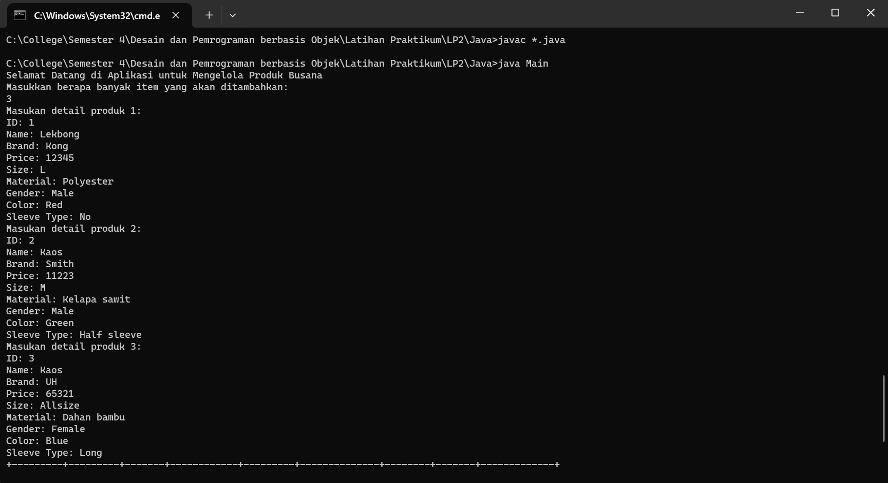
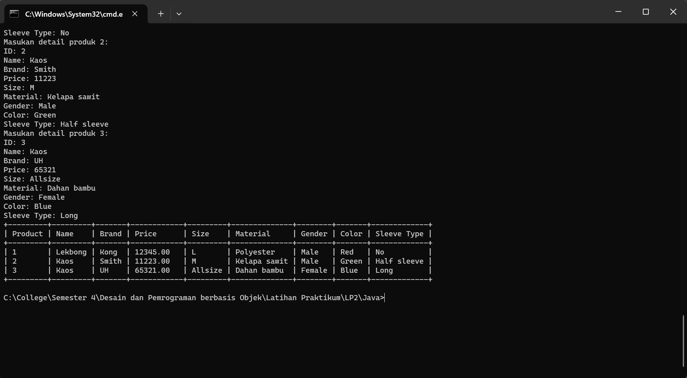
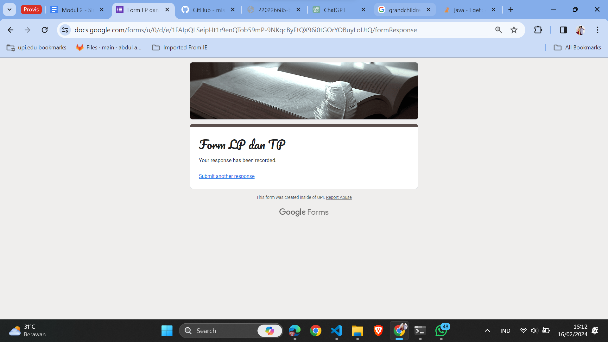

# Latihan Praktikum 2 DPBO 2024

## Janji

Bismillah
Saya Themy Sabri Syuhada dengan NIM 2203903. Demi keberkahan-Nya, saya berjanji mengerjakan latihan praktikum 1 DPBO dengan jujur dan tidak melakukan kecurangan seperti yang telah dispesifikasikan.
Aamiin.

## Deskripsi Program

Program yang diberikan adalah sebuah aplikasi sederhana yang memungkinkan pengguna untuk memasukkan detail produk pakaian (Shirt) dan menampilkan data produk dalam format tabel yang dinamis. Program ini ditulis dalam bahasa pemrograman Java dan menggunakan konsep Object-Oriented Programming (OOP), terutama konsep Multi-level Inheritance.

- Program ini terdiri dari empat kelas: Product, Clothing, Shirt, dan Main.
- Product adalah kelas dasar yang merepresentasikan sebuah produk umum dengan atribut seperti ID, nama, merek, dan harga.
- Clothing adalah subkelas dari Product yang merepresentasikan produk pakaian dengan tambahan atribut seperti ukuran, material, dan gender.
- Shirt adalah subkelas dari Clothing yang merepresentasikan jenis pakaian berupa kemeja dengan tambahan atribut seperti warna dan jenis lengan.
- Main adalah kelas tempat program dimulai dan berisi metode main untuk menjalankan program. Pada kelas ini, pengguna diminta untuk memasukkan detail produk pakaian \* (Shirt) melalui input dari keyboard, dan kemudian data tersebut ditampilkan dalam bentuk tabel.

## Alur Program

1. Pengguna menjalankan program.
2. Program meminta pengguna untuk memasukkan detail produk pakaian (Shirt) melalui input dari keyboard.
3. Pengguna diminta untuk memasukkan detail produk sebanyak tiga kali.
4. Setiap kali detail produk dimasukkan, program membuat objek "Shirt" berdasarkan input tersebut dan menyimpannya dalam ArrayList.
5. Setelah semua produk dimasukkan, program menentukan lebar kolom header tabel sesuai dengan panjang kata terpanjang dalam setiap kolom.
6. Program menampilkan header tabel dengan lebar kolom yang disesuaikan, diikuti oleh data produk dalam format tabel dengan lebar kolom yang disesuaikan.
7. Program menampilkan garis pembatas akhir tabel.
8. Program selesai.

## Screenshots

1. Run in Java
   
2. Result with Java
   
3. Coba push gambar
   
